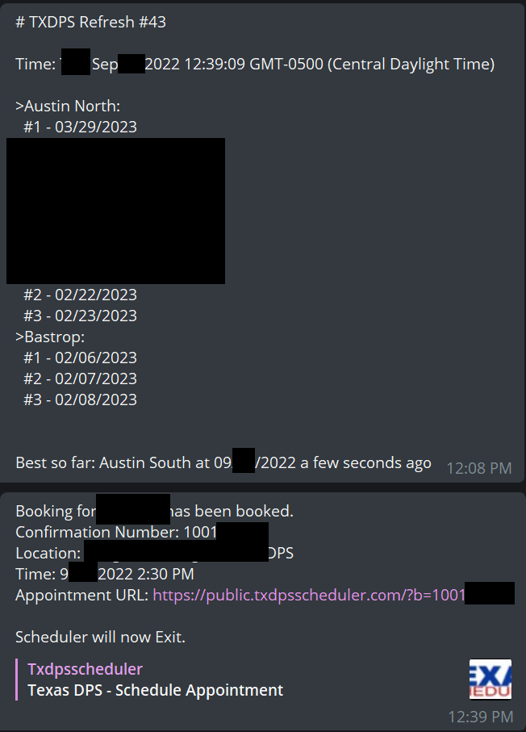

# texas-dps-scheduler

This is a fork of [phamleduy04/texas-dps-scheduler](https://github.com/phamleduy04/texas-dps-scheduler).

## What has changed?

- Added random noise to recheck frequency and make the request look more like to be from a real browser.
- You can use a telegram bot to keep updated on the current progress.
- For people who has strict schedules you can specify specific time slots you are available.

## How to use?

I only validated running through `docker`, `docker-compose` and direct `npm run`. 

If you would like to use replit you are unfortunately on your own. 

---
From original README.md:

# Why this project exist?
It's so frustrating to get appointments and walk ins so I created this project to gain easier access to DPS and get DL.

# Is this illegal?
Honesty, I don't know. Just dont abuse it :)

# How to use this project
You can access the wiki [here](https://github.com/phamleduy04/texas-dps-scheduler/wiki/Installation)
